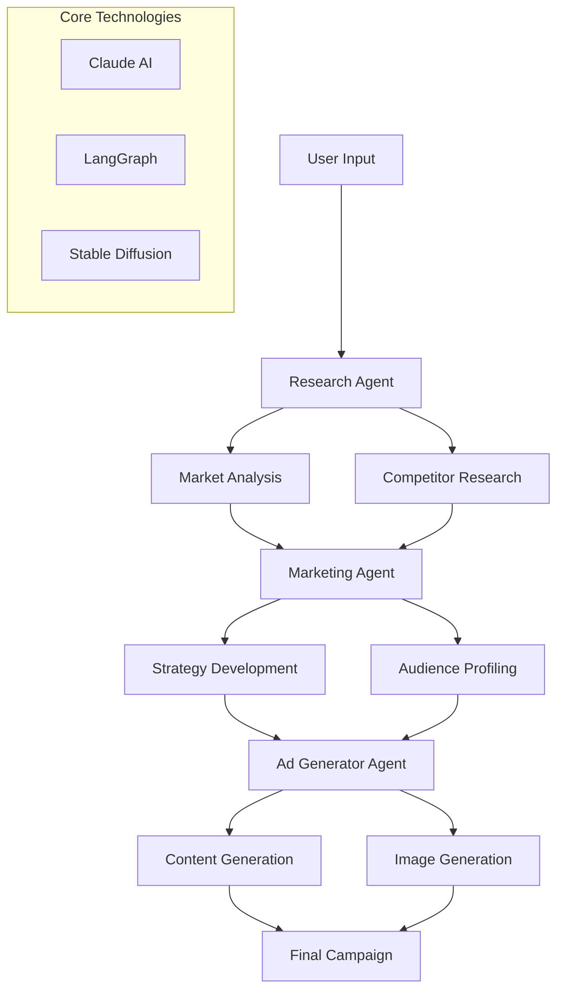

# AdVocate: AI-Powered Ad Generator

AdVocate is an AI-powered platform that automates the creation of marketing research and advertisements using Claude AI, LangGraph, and Stable Diffusion. It employs specialized AI agents to streamline market analysis, strategy development, and content generation.

## Architecture Flow



## Key Features

-   **Automated Market Research:** Conducts in-depth market research and generates insightful reports using Claude AI
-   **AI-Driven Marketing Strategies:** Develops comprehensive marketing strategies using LangGraph for workflow orchestration
-   **Ad Content Generation:** Creates engaging ad content and generates visuals using Stable Diffusion

## Core Components

### Research Agent (`src/agents/research/`)
- Conducts automated market research using Claude AI
- Generates research questions
- Analyzes market data
- Produces structured reports

### Marketing Agent (`src/agents/marketing/`)
- Analyzes brand voice and market positioning
- Creates detailed audience profiles
- Generates campaign ideas using LangGraph
- Develops data-driven marketing strategies

### Ad Generator (`src/agents/AdGen/`)
- Creates compelling ad content
- Generates optimized image prompts
- Processes campaign requirements
- Creates visual assets using Stable Diffusion

## Technical Architecture

The solution uses a modular architecture with three main agents orchestrated by LangGraph:

1. **Research Phase**
   - Research Agent utilizes Claude AI for market analysis
   - Generates comprehensive market insights
   - Identifies key market opportunities and trends

2. **Strategy Phase**
   - Marketing Agent processes research data
   - Develops targeted marketing strategies
   - Creates audience-specific campaign plans

3. **Generation Phase**
   - Ad Generator creates content using Claude AI
   - Generates visuals with Stable Diffusion
   - Combines elements into cohesive campaigns

## Setup Instructions

1.  **Clone the repository:**
    ```bash
    git clone [https://github.com/JNK234/AdVocate---AI-Ad-Generator.git](https://github.com/JNK234/AdVocate-Agentic-Ad-Generator.git)
    cd AdVocate-Agentic-Ad-Generator
    ```

2.  **Configure the environment:**
    ```bash
    cp .env.template .env
    ```
    Edit the `.env` file with your API credentials.

3.  **Install dependencies:**
    ```bash
    pip install -r requirements.txt
    ```

4.  **Run the application:**
    ```bash
    streamlit run app.py
    ```

## Requirements

-   Python 3.8+
-   Claude API access
-   Stable Diffusion
-   Streamlit
-   LangGraph
-   LangChain

## Project Structure

```
├── ad_generation_app.py     # Main application file
├── app.py                   # Streamlit web interface
├── campaign_generator.py    # Campaign generation logic
├── main.py                  # Main execution script
├── models/                  # AI models and data storage
│   └── vectorstore/         # Vector storage configurations
├── src/                     # Source code directory
    ├── agents/             # AI agent implementations
    │   ├── research/      # Market research agent
    │   ├── marketing/     # Strategy development agent
    │   └── AdGen/         # Ad generation agent
    ├── config/            # Configuration settings
    └── core/              # Core functionalities
```
